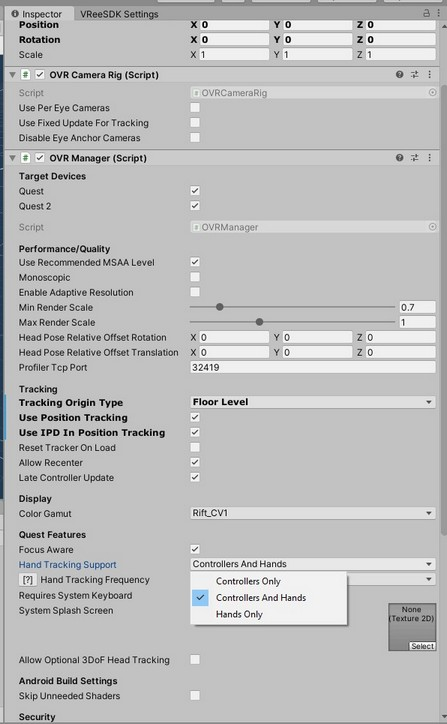

# Quest Handtracking

## 1. Downloads

1. Download the QuestIntegration Unity package from the [Downloads page](https://developer.vree.world/dashboard/ "Downloads page")
1. Import the package into your Unity project.
1. From the Unity Asset Store download and import the [Oculus Integration Asset](https://assetstore.unity.com/packages/tools/integration/oculus-integration-82022/ "Oculus Integration Asset") 

## 2. Settings

1. In Unity, go to `VReeSDK > Settings`
1. Drag the `OculusQuestIntegrationCamera` prefab into `Build Targets > Target HMD`
1. Add the Quest Hand Tracking Adapter to the adapter list.

1. Open the OculusQuestIntegrationCamera prefab and select the `OVRCameraRig`. In the Inspector switch the `Hand Tracking Support` dropdown to "Controllers and Hands" or "Hands Only". 

1. Verify that hand tracking is enabled in your Oculus Quest VR Device.

## 3. Building

1. Build your application to the Oculus Quest. 
1. For the build instructions for the Oculus Quest please refer to : [Getting started with Oculus Quest](https://docs.vree.world/en/latest/getting-started-oculus/ "Getting started with Oculus Quest")

