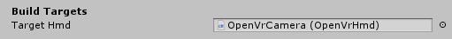

# Downloading and Importing the SDK

To get started using the VRee SDK for Unity, download the latest version of the SDK from the [downloads](http://developer.vree.world/downloads) page. Once the file has finished downloading, open `Unity 2017.4 LTS` or higher.

**Using Unity Package**  
In Unity, go to `Assets > Import Package > Custom Package…` and select the VRee SDK for Unity. Make sure that all files are selected by clicking on the `All` button in the bottom left corner before importing the package using the `Import` button.

**Using Example Project**  
Extract the folder to your preferred location and open it as a Unity project.

## Installing Prerequisites

The following prerequisites **must** be installed for the VRee SDK to work properly. Due to the way Xsens handles their licenses, an blank Xsens license has to be generated. Without this license, Unity will appear to hang after clicking the play button.

Navigate to the `VReeSDK/Prerequisites` folder in your explorer and extract the `SoftwareActivation.7z` file. It's recommended to extract it outside of the project to prevent DLL conflicts. Run the `activateLicense.bat` batch file to active a blank Xsens license.

The VRee SDK requires the `C++ 2015 Redistributable`, which be downloaded from the [Microsoft Download Center](https://www.microsoft.com/en-us/download/details.aspx?id=53840).

### Firewall

Additionally, in order to correctly send and receive multiplayer data, a firewall exception rule has to be added for Unity. This exception allows the SDK to communicate with players on the same network.
The chosen port (found in `VReeSDK > Settings`) +1 for every player should be forwarded:

> Example: Port 9999 with 4 players. Ports 9999 to 10003 have to be port forwarded.

## Registering a License

To use the VRee SDK for Unity, a valid VRee license has to be installed on the machine. A license can be registered by going to `VReeSDK > Register License…`.

Insert your VRee Account username and password and choose a suitable device and developer name for the developer seat. After clicking the register button, the license is downloaded from the VRee servers and placed in the root of the project.

> In the Unity Editor the license file should be next to the `Assets` folder. In a build, the license file should be next to the `.exe`.

# Preparing the Development Environment

Drag the `[VReeSDK]` and `[VReeSDK_UI]` prefabs from `VReeSDK/Prefabs/` into the scene, or open the provided example scene from `VReeSDK/Scenes`.

## Selecting the Target Hardware

When building the application from Unity, the VRee SDK needs to know on what hardware the application will run on. To change the build target, navigate to `VReeSDK > Settings > Build Target`. Then, in the Assets folder, find the hardware to use as a build target in `VReeSDK/Hardware` and drag the Camera prefab into the `HMD Build Target` field.

> Example: building to HTC Vive Focus 
> Drag the `VReeSDK/Hardware/ViveFocus/Prefabs/ViveFocusCamera` prefab into the `VReeSDK > Settings > Build Targets > Target Hmd` field.    Keep in mind that using the HTC Vive Focus requires the [WaveVR SDK]("https://developer.vive.com/resources/mobile-vr/") to be installed.

## Using Adapters

The VRee SDK uses [adapters]("adapters.md") to modify the player avatars. The `VReeSDK > Settings` window displays the active adapters.

Using this list, adapters can be added or removed by clicking the plus or minus button.

> The adapter used by the build target are grayed out and cannot be removed.

Additionally, the execution order of adapters can be changed by dragging and dropping the adapters. The adapters in this list are executed from top to bottom.

> When changing the execution order of adapters, keep in mind that multiple adapters can modify the same data, overwriting the data set by adapters that executed before it.

# Building the Application

> Note: During development, the Windows Server and Windows clients can run in the Unity Editor.

## Windows Server

To build the server application, make sure `VReeSDK > Settings > Networking Roles > Windows Role` is set to `Server`. Next, navigate to `File > Build Settings...` to open the Build Settings. Set the platform to `PC, Mac & Linux Standalone` and set the `Architecture` to `x86_64`. Finally, press `Build` to start building the server application.

## Windows Client

For HMDs that run on windows such as the HTC Vive and Oculus Rift, set the `VReeSDK > Settings > Networking Roles > Windows Role` to `Client` and follow the build steps above.

## Android Client (standalone HMD)

For HMDs that run on their own such as the GearVR, HTC Focus and Oculus Quest, set the `VReeSDK > Settings > Networking Roles > Android Role` to `Client`. Next, navigate to `File > Build Settings...` to open the Build Settings. Set the SDK to `Android`. Finally, press `Build` to start building the client application.

# Running the application

Start both the client and server application and wait for the client to connect. While connecting, the client's screen will remain black.

As soon as the connection is established the client will be visible on the server's UI, and the client's screen will be rendered.

> Note: It is recommended to run the server and client on separate systems. Unexpected behavior may occur while running both applications on the same system.
