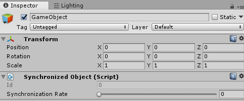
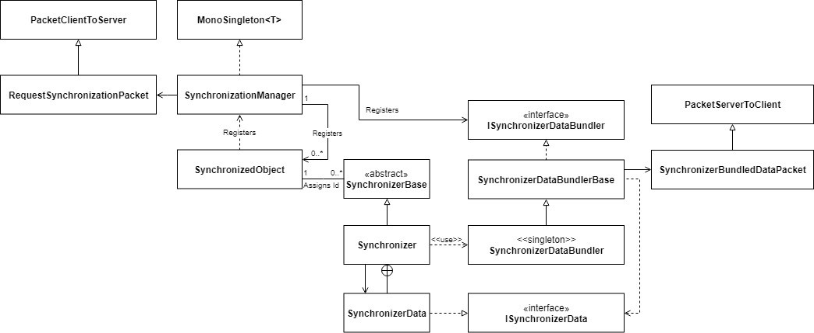
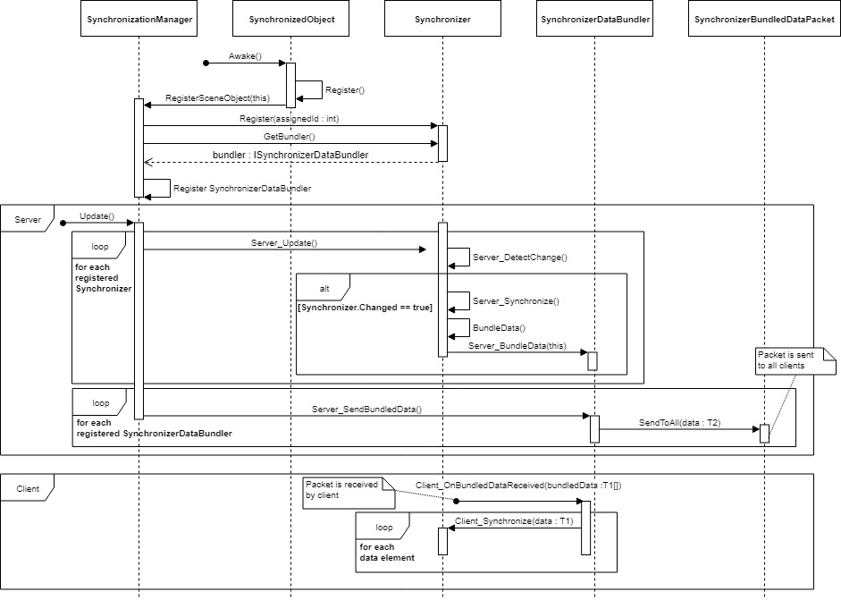

# Packets

A VRee Packet is essentially a wrapper around user data that can be easily sent over the network. The VRee Platform provides two types of packets: `PacketServerToClient` and `PacketClientToServer`. Packets are one-way traffic, meaning that a `PacketServerToClient` can only be sent from the server to a client and a `PacketClientToServer` can only be sent from a client to the server.

A packet can contain up to eight parameters. However, a packet can contain more data by creating a struct that holds multiple fields. Keep in mind that the maximum data size of a packet is `1400 bytes`, going over this value causes the packet to be split into multiple packets which increases packet drop rate.

## Defining a Packet

A packet is defined by creating a new class which extends from the PacketServerToClient base class or the PacketClientToServer base class. In the example shown below, a PacketServerToClient is created with one integer parameter.

```c#
public class MyPacketServerToClient : PacketServerToClient<int> { }
```

If a packet is important and needs to be **more likely** to arrive, the `IsReliable()` method can be overwritten to return true.

```c#
public override bool IsReliable()
{
   return true;
}
```

This will tell the VRee Platform to try to send the packet until it is received by the client or until the `maximum reliable packet resend count`[^1] is reached. Remember that flagging a packet as reliable puts a bigger strain on the network.

[^1]: Refer to the [VRee Settings documentation](/vree-settings/) for more information.

## Sending a Packet

Any packet can be created using the `VReePlatform.CreatePacket<T>()` call. After the packet is created, it is sent using one of the send methods.

```c#
// PacketServerToClient
VReePlatform.CreatePacket<MyPacketServerToClient>().SendToAll(parameters) // Sends the packet to all connected clients.
VReePlatform.CreatePacket<MyPacketServerToClient>().Send(playerId, parameters) // Sends the packet to a specific client.
```

```c#
// PacketClientToServer
VReePlatform.CreatePacket<MyPacketClientToServer>().Send(parameters)
```

## Receiving a Packet

A packet can be received in two ways:

_Option 1:_ Adding a Packet Listener from any class to the packet.

```c#
VReePlatform.CreatePacketCallbackListener<MyPacketClientToServer>().AddPacketListener(MyPacketClientToServerListener);
```

```c#
public void MyPacketClientToServerListener()
{
    // Do something.
}
```

_Option 2:_ Overriding the `OnReceive()` method in the packet class.

```c#
public override bool OnReceive()
{
   // Do something.
}
```

# Object Synchronization

The VRee SDK for Unity allows developers to easily synchronize data using the Synchronization add-on. The synchronization plugin automatically synchronizes the data when the data has changed and bundles the information to optimize the network traffic.

- By default, two synchronizers are included: - `TransformSynchronizer` – synchronizes the position, rotation and scale of the Unity Transform component. - `EnabledStateSynchronizer` – synchronizes the enabled state of the GameObject.

To start using the Synchronization add-on, simply add the `SynchronizedObject` component to a GameObject. This component marks the GameObject as synchronized and gives it a unique Id. On this component, the rate at which the data should be synchronized can be defined. By default, the synchronization rate is set to synchronize every frame.



In the current state, the GameObject is marked as synchronized but nothing is being synchronized. To synchronize data, at least one Synchronizer has to be attached to the GameObject. In this example, the `TransformSynchronizer` is used. However, multiple synchronizers can be attached. As seen in the image below, the Synchronizer can override the synchronization rate set by the SynchronizedObject. Here, the synchronization rate for the TransformSynchronizer is set to once per second.


To synchronize the Transform of the GameObject, only the SynchronizedObject and Synchronizer components are required. The object will now move, rotate and scale on all clients.

## Creating Custom Synchronizers

Custom synchronizers can be created take advantage of the Synchronization system’s automatic data bundling. In this example, we’ll create a `CustomSynchronizer` that synchronizes an integer. The class diagram shown below explains how the Synchronization system connects the classes necessary for synchronization. For the `CustomSynchronizer`, three new classes will be created: `CustomSynchronizer`, `CustomSynchronizerDataBundler` and `CustomSynchronizerBundledDataPacket`.



- The `CustomSynchronizer`, this class extends from SynchronizerBase. This class defines the Data struct and is responsible for determining if the data has changed.
- The `CustomSynchronizerDataBundler`, this class extends from SynchronizerDataBundlerBase which handles the data bundling.
- The `CustomSynchronizerPacket`, this class extends from PacketServerToClient<CustomSynchronizer.Data[]> and contains the data bundled by the CustomSynchronizerDataBundler.

A couple of virtual methods have to be overwritten in the CustomSynchronizer script.

- The `Register()` method should call CustomSynchronizerData.RegisterSynchronizer() method with itself as parameter, this ensures that the data can arrive to the Client_Synchronize() method on the client.
- The `Server_DetectChange()` to set the Synchronize flag to true when the data has changed.
- The `Client_Synchronize()` method should validate the data type and update the local values with the data values.

The data struct must contain an integer field storing the Id and any optional data fields. In this case, the `IntegerData` field is added.

```
[DisallowMultipleComponent] // Make sure only one of this synchronizer can be added per GameObject.
public class CustomSynchronizer : SynchronizerBase
{
    /// <summary>
    /// Defines the data this Synchronizer will synchronize to the clients.
    /// </summary>
    public struct Data : ISynchronizerData
    {
        public int Id;
        public int IntegerData; // <- Added the integer data field.

        public int GetId()
        {
            return Id;
        }
    }

    /// <summary>
    /// Stores the previous state of the data.
    /// </summary>
    private int _previousIntegerData; // <- Store the previous integer data.

    /// <summary>
    /// Stores the current state of the data.
    /// </summary>
    [SerializeField] private int _integerData; // <- Store the current integer data.

    /// <summary>
    /// Checks for changes in data.
    /// </summary>
    protected override void Server_DetectChange()
    {
        base.Server_DetectChange();

        if (_integerData != _previousIntegerData) // <- Check if the integer data was changed.
        {
            Synchronize = true;
        }

        _previousIntegerData = _integerData; // <- Set the previous integer data.
    }

    /// <summary>
    /// Registers itself to the SynchronizerDataBundler.
    /// </summary>
    /// <param name="assignedId">The UniqueId assigned to the SynchronizedObject.</param>
    internal override void Register(int assignedId)
    {
        base.Register(assignedId);

        CustomSynchronizerDataBundler.Instance.RegisterSynchronizer(this); // <- Register the CustomSynchronizer.
    }

    /// <summary>
    /// Gets the current data.
    /// </summary>
    /// <returns>The current data struct.</returns>
    public override object GetData()
    {
        return new Data() // <- Return the Data struct with the current integer data.
        {
            Id = AssignedId, // This value must be the AssignedId of the Synchronizer.
            IntegerData = _integerData
        };
    }

    /// <summary>
    /// Bundles the data.
    /// </summary>
    public override void BundleData()
    {
        CustomSynchronizerDataBundler.Instance.Server_BundleData(this); // <- Bundle the data for the CustomSynchronizer.
    }

    /// <summary>
    /// Gets the data bundler for this synchronizer.
    /// </summary>
    /// <returns></returns>
    public override ISynchronizerDataBundler GetBundler()
    {
        return CustomSynchronizerDataBundler.Instance; // <- Return the CustomSynchronizer DataBundler.
    }

    /// <summary>
    /// Updates the synchronized data from the server.
    /// </summary>
    /// <param name="data">The data to be updated.</param>
    internal override void Client_Synchronize(ISynchronizerData data)
    {
        VReePlatform.ValidateClient(); // Validate the role.
        if (!(data is Data)) { return; } // Check if the data is the correct type.

        Data synchronizedData = (Data)data;

        // Update the synchronizedData on the client.
        _integerData = synchronizedData.IntegerData; // <- Set the current data.
    }
}
```

```
/// <summary>
/// The data bundler for this synchronizer.
/// </summary>
internal class CustomSynchronizerDataBundler : SynchronizerDataBundlerBase<
    CustomSynchronizer,
    CustomSynchronizer.Data,
    CustomSynchronizerBundledDataPacket>
{ }
```

```
/// <summary>
/// The synchronizer bundled data packet.
/// </summary>
internal class CustomSynchronizerBundledDataPacket : PacketServerToClient<CustomSynchronizer.Data[]> { }
```

To get a better understanding of how the synchronization system works internally, refer to the following sequence diagrams.


