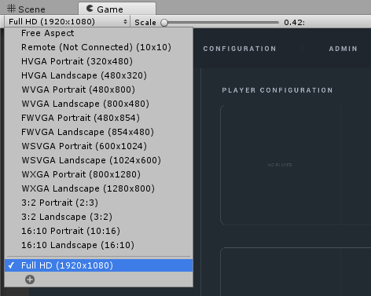
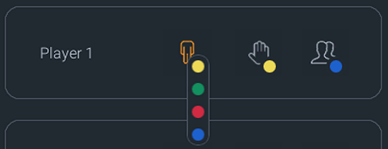
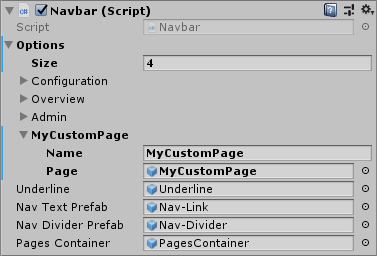

# User interface

The VRee SDK comes with the `[VReeSDK_UI]` prefab which contains the user interface for the VRee SDK. The UI scales with a `16x9` aspect ratio and it is therefore recommended to set the Unity Game view to a multiple of this aspect ratio, for example `1920x1080`.

## Connected players

The left side displays a list of currently `Connected Players` _(1)_. The list is automatically updated whenever a player connects. For each player, the `body controller`, `hand controller` and `group` are displayed.

When the battery level of a hardware drops below 20%, a battery icon is displayed to the left of the hardware group. The battery icon next to the player name corresponds with the battery level of the client device.

Clicking on one of the color-coded icons shows the available hardware options. These options are configured in the `ColorMappings.txt` file in the application root.

The `Calibrate` and `Recenter` buttons are activated when one or multiple players are selected from the `Connected Players` list _(2)_. The calibrate button starts the calibration process and the recenter button sets the position of the player back to the selected `player field` defined in the [VRee Settings](vree-settings.md#player-fields).

On the right side of the user interface, the `Player Cameras` are displayed, showing a first-person view of the player _(3)_.

## Adding custom pages

By default, the UI consists of three pages: Configuration, Overview and Admin. However, it is often necessary to configure applications using a user interface. Rather than creating an additional canvas and interface, the `[VReeSDK_UI]` exposes the ability to add custom user pages.

In the `[VReeSDK_UI]`, navigate to the `Canvas > Header > NavbarModule > Navbar` script. In this script, add a new `option` by incrementing by one. Open the newly added option, give it a name and select the GameObject page.

When a prefab is added to the option that does not exist in the hierarchy, it will be instantiated and moved to the correct position in the hierarchy.

> The page's `RectTransform` will be modified to fit within the user interface.

