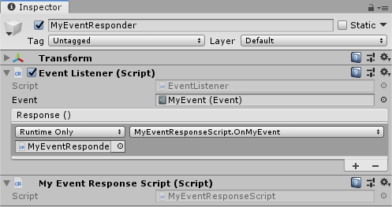

# VRee Events

VRee Events are an extension of the [Unity Event System](https://docs.unity3d.com/ScriptReference/Events.UnityEvent.html). VRee Events use scriptable object event instances to achieve a truly decoupled system.

The VRee SDK comes with three events: `Event` `Event<Player>` `Event<Player, AdapterBase>`. Additionally, custom events can be created using the event generation window `VReeSDK > Events > Generate Event...`.

## Creating VRee Events

In the `VReeSDK > Events > Generate Event...` window, select the folder in which to generate the event.

Select the folder in which to generate the event files and add parameters in order to generate the event.

To add parameters to the event, click `Add`, search for the desired parameter type and click on the result to add the parameter.


Validate the summary and click `Generate` to generate the event.

Finally, create the event instance by going to `Create > VReeSDK > Custom Events` and selecting the generated event. This created the scriptable object event instance which can be referenced from anywhere.

## Using VRee Events

### Raising

To raise the event, reference the event instance in a script and call the `Raise()` method. This will cause the event to raise and all listeners to be notified.

```c#
public VRee.Events.Event MyEvent;

private void Start()
{
    MyEvent.Raise();
}
```

### Listening

Listening to a VRee Event can be done in the inspector or via code. The following code adds a listener to to event programmatically.

```c#
public VRee.Events.Event MyEvent;

private void Start()
{
    MyEvent.AddListener(OnMyEvent);
}

public void OnMyEvent()
{
    Debug.Log("MyEvent was raised!")
}
```

The same can be done by adding an `EventListener` to an object and adding responses to the Unity Event.


