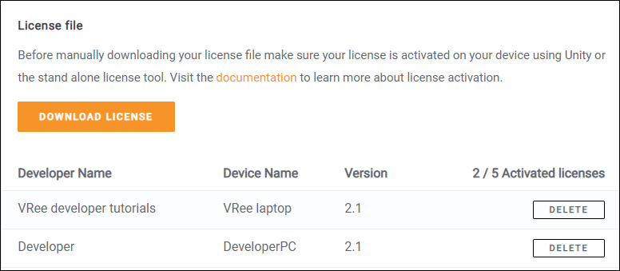

This chapter details the usage of VRee license key files and license files. To generate a license, refer to [Getting Started – Generating a License](getting-started.md#generating-a-license)

When a license is generated, a key file is generated that is linked to the machine on which the key was requested. This key file is placed in the root of the project. The VRee License file is created using all the key files present in the root of the project.

The key files can be downloaded from the VRee Licenses page. Refer to the License Management chapter for more information.

To manually generate the license file, place the key files in the root of the project and select `Merge Keys` from the `VRee > Generate License…` window. This creates a License file using the supplied key files.

Only the server application requires a license.

#License management
Managing the VRee licenses can be done through the license page on the developer portal. Go to `developer.vree.world` and log in using your VRee account information. Alternatively, the page can be loaded from Unity by navigating to `VRee > Generate License` and clicking on the `To Overview` button.

In the top of the page the maximum amount of simultaneous licenses is shown, as well as the currently activated count.

Each activated license is shown in the list below and can be downloaded or deleted using the interface buttons.
The licenses can be freely removed and re-requested as many times as required. Keep in mind that a deleted license will no longer function on a VRee enabled application.

# Troubleshooting

The following chapters can be used to troubleshoot license errors.

## No License Found pop-up

The `No License found!` pop-up is shown when the application is started without a valid license. When no license file is found, the license path is shown in the pop-up. To resolve this issue, make sure the license path contains a license file named `License.lic`.

The pop-up is also shown when a license was found, but the license is not valid on this machine. In this pop-up, the license keys are shown that correspond to this license. This issue can be resolved either by placing the correct license file in the license path, or by generating a new license (see Generating a License). When running from a build, the `License.lic` file should be next to the application executable.

A new license can be generated without the VRee SDK in Unity by [downloading](https://developer.vree.world/Downloads "VRee Downloads") the `VRee Standalone License Request Tool`.

## License Request Failed pop-up

When generating a new license, the request may fail. This can be due to several issues:

- Incorrect user information - Make sure the Username and Password field contain the correct VRee account information. `Uppercase I’s` may be confused with `lowercase L’s` and vice versa.
- The machine already has a license key generated. - Remove the license key using the VRee License web interface before generating the license. - Download the license key and manually merge the license.
- No internet connection is available. - Generating the license requires the VRee SDK to communicate with the VRee License Server. Make sure the machine is connected to the internet.
- The VRee License is unavailable. - Confirm that the server cannot be reached by going to the VRee License Page. - Contact VRee if the License Server is unavailable.

