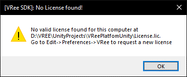

> Please refer to [Getting Started - Registering a License](getting-started.md#generating-a-license) to learn how to register a license.

# VRee license

In order to use the VRee SDK, a license seat has to be registered to your VRee Account. When the application is started as a server, the VRee SDK checks if a license is present in the root of the application.

> A VRee License is only required on the server application.

## Offline license

The VRee license may be used offline for a number of times. When running the application without an internet connection, a log will notify that an offline license count has been consumed.

# License management

The VRee license can have a number of active developer seats. Managing these developer seats can be done through the dashboard page on the [developer portal](https://developer.vree.world/dashboard).

> Alternatively, the page can be opened from Unity by navigating to `VReeSDK > Register License...` and clicking on the `Open Developer Dashboard` button.

License seats can be freely deleted and activated as many times as required. Keep in mind that when the license seat is deleted, the VRee SDK will no longer function on the device.

If the license file is ever lost, it can be downloaded using the `Download license` button. Be sure to place the downloaded file in the root of the application.

# Troubleshooting

## No license found pop-up

The `No License found!` pop-up is shown when the application is started without a valid license in the application root.

To resolve this issue, make sure the license path contains the license file which may be [generated](getting-started.md#generating-a-license) or [downloaded](#license-management).

A new license may also be generated using the [VRee Standalone License Request Tool](https://developer.vree.world/Downloads).

## License Request Failed pop-up

When generating a new license, the request may fail. This can be due to several issues:

- Incorrect user information - Make sure the Username and Password field contain the correct VRee account information. `Uppercase I’s` may be confused with `lowercase L’s` and vice versa.
- The machine already has a license key generated. - Remove the license key using the VRee License web interface before generating the license. - Download the license key and manually merge the license.
- No internet connection is available. - Generating the license requires the VRee SDK to communicate with the VRee License Server. Make sure the machine is connected to the internet.
- The VRee License is unavailable. - Confirm that the server cannot be reached by going to the VRee License Page. - Contact VRee if the License Server is unavailable.

