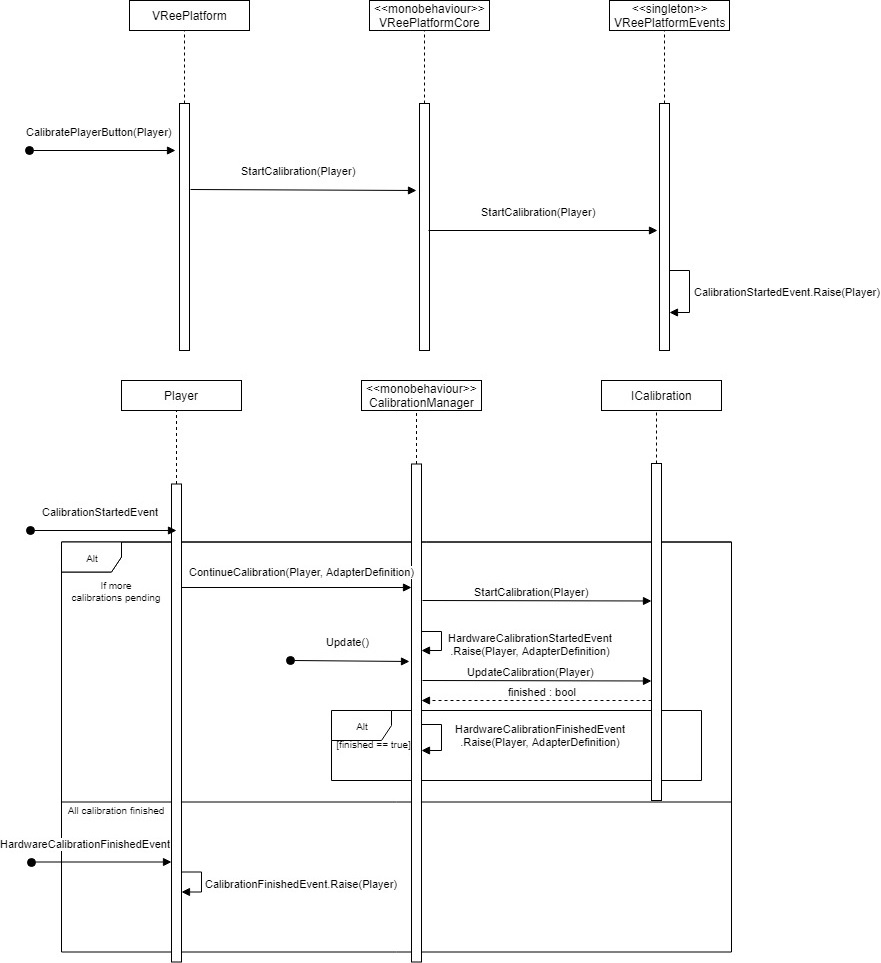

# VRee player

## Player details

A VRee player is created for every user connected to the application. All information available for the player can be found in the Inspector by selecting the root for the player on the server. Each adapter can be expanded to display adapter specific information.

## Player model

A player model, defined in `VReeSDK > Settings > Player Settings`, is attached to the VRee Player. Any model can be used for the player as long as the model is in a valid Unity Mecanim Humanoid format.

> Note that the first and third person skeleton rig must be identical.

## Player avatar system

The player avatar system automatically synchronizes the player model's bones over the network using highly optimized data packets. This data may be modified before synchronization using [adapters](adapters.md).

# calibration // TODO

_Calibration diagram_
